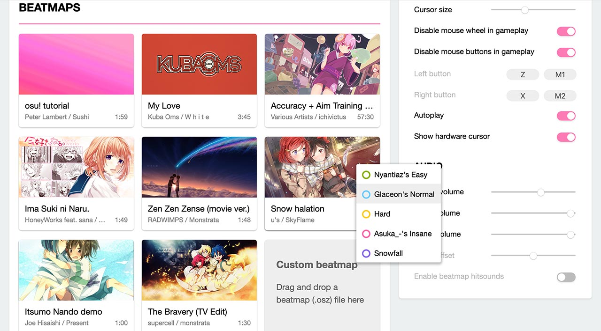
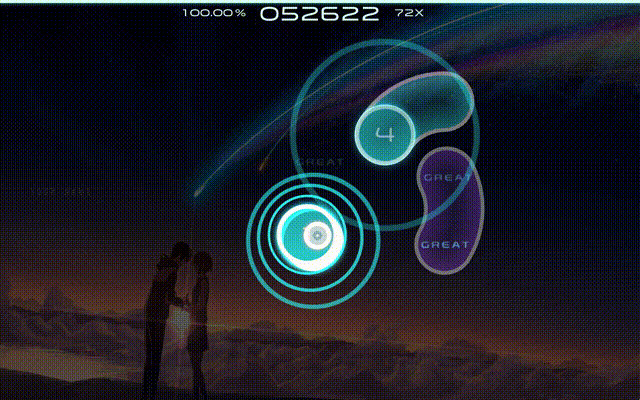

# osu! web

osu! that can be played in a browser

(under development)

In case you haven't heard of osu!, it's a game where players click circles on the screen, following rhythm of the music.

It runs on Firefox & Chrome. It doesn't run on Safari currently.

Note: This is an unofficial implementation of [osu!](https://osu.ppy.sh). It has nothing to do with @ppy. Scoring and judgement rules can differ from that of official osu!.

## Screenshots

web page:



game in action:



## Hosting

Just set up a local web server with root directory located where `index.html` is in.

## Current functions

#### general

- scroll to change volume: yes
- keyboard button: yes (z x)
- Hit circle: yes
- Slider: partial
- Spinner: no

#### difficulties

- CS: yes
- AR: yes
- OD: yes
- star: yes (thanks to sayobot)
- life drain: yes
- score: yes
- accuracy: yes
- combo: yes

#### graphics

currently mixing lazer & stable osu! styled visual elements.

- background: yes
- background dim: yes
- background blur: no
- object fade in/out: yes
- slider snake-in: no
- slider snake-out: no
- hit burst light: yes
- hit ring glow: no
- beatmap combo color: yes
- beatmap skin: no
- custom skin: no

#### Hit sounds

currently using lazer hit sounds.

- beatmap general sampleset: yes
- edgeAdditions: yes
- slider reverse & end: always
- slider tick: no
- timing point sample: yes
- timing point volume: yes
- hit-specific sample: yes
- hit-specific volume: yes
- beatmap hitsounds: no

## Rules

#### General

Game field: 512 x 384 (in osu! pixels)

Circle diameter: `109 - 9*CS` (in osu! pixels)

Approach Time: `AR<5? 1800-120*AR: 1950-150*AR`

Scoring: `(score for each hit) = judgement * (1 + (Combo before this hit) / 25)`

Grading: (not implemented)

```c#
SS: acc = 1
S: acc > 0.95
A: acc > 0.9
B: acc > 0.8
C: acc > 0.7
```

#### Hit circle judgement:

```c#
300: +-(80 - 6*OD) ms
100: +-(140 - 8*OD) ms
50: +-(200 - 10*OD) ms
```

#### Slider judgement:

start of slider: same as hit circle

#### Spinner judgement:

Spins required per second: `OD<5? 3+0.4*OD: 2.5+0.5*OD`

```c#
300: Progress >= 1
100: Progress > 0.9
50: Progress > 0.75
```
## Architecture

Everything runs at clientside. just to make it easier to deploy.

#### source files

`main.js`
	start load resources, setup environment, respond to webpage

`settings.js`

	responsible for the settings panel on webpage: helping with visualization; store settings to localStorage; bring them into effect (before game starts)

`osu.js`

	decode .osu file & load music

`playback.js`

	defines `Playback` class, which creates & updates shapes in realtime, controls game update, judgement & display.

`playerActions.js`

	check hits (only hitcircles and start of sliders), called by playback.js. also handles input events

`score.js`

	calculates combo, score, accuracy, HP & set them in display

#### resources

`skin` stores all sprite textures in the game

`hitsounds` stores hit sounds

Most materials in these folders are copyrighted to ppy, licensed under CC-BY-NC.

In addition, the free osu beatmap mirror site `sayobot.cn` is used for displaying stars and length of beatmaps on the webpage.

#### members of `Playback`

 `plackback.js` is getting long and hard to read at first glance so I'll list them here.

```javascript
    var gfx // game field area
    this.hits // array of hitobjects (including sprites & display info)
    this.scoreOverlay // for calculating & displaying score, combo etc.

    this.calcSize = function() // determin gaming field & element scaling
    this.replaceHit = function(hit, zoom) // refresh position & scale of hitobjects
    window.onresize = function() // window resize handling

    this.newJudgement = function(x, y, depth, finalTime) // creating judgement object
    this.updateJudgement = function(judgement, time) // set judgement display

    this.createBackground = function()
    this.createHitCircle = function(hit, objects = hit.objects)
    this.createSlider = function(hit)
    this.createSpinner = function(hit) 
    this.populateHit = function(hit)

    this.updateBackground = function(time) // used for background diming animation
    this.updateHitCircle = function(hit, time)
    this.updateSlider = function(hit, time)
    this.updateSpinner = function(hit, time)
    this.updateHitObjects = function(time)
    this.updateUpcoming = function(timestamp) // add upcoming hit objects to stage & destroy expired hit objects

    this.playHitsound = function(hit, id)
    this.hitSuccess = function(hit, points, time) // handles hit event of hit circle or start of slider
    this.render = function(timestamp) // called in the main loop

    // depth attributes of objects are for display layering

```

#### Execution sequence

`main.js` loads other scripts needed -> load skin & hitsounds & local beatmaps

import a beatmap: get blob -> zip import -> osu decode -> put on webpage

play: check for skin & hitsounds -> launch PIXI app & audiocontext -> set gaming area on page -> start game loop, enter playback & start loading music

## Notes

- currently using sound.js for hitsound, but not music.

- don't know what `firefox` and `api` and `hash` is for...

- If a slider is longer than given `PixelLength`, just truncated it -- This is what's done officially

- About mesh antialiasing: just blur the texture a little bit...

- layering: approach circle > hit circle > slider ball > follow circle > slider body


## Future Plan

First I'll work on core gaming experience, including:

- corrent rendering of hit circles, sliders and spinners
- accurate music & hitsounds
- accurate hit grading

Latency should be adjustable.

Scoring, deaths, skins and some of mods might be implemented later on, depending on code complexity.

Modes other than STD (osu) will not be implemented.

## Notes from ddevault/osuweb

For getting replays

https://osu.ppy.sh/web/osu-getreplay.php?c=1740197996&m=0&u=SirCmpwn&h=531445fb945017068978ed385051c204

h is the md5 hash of the map?
c is the replay to get
u is neccessary and it has to match my cookies, fuck that shit

For getting scores:

```
https://osu.ppy.sh/web/osu-osz2-getscores.php?s=0&vv=2&v=1&c=da8aae79c8f3306b5d65ec951874a7fb&f=xi+-+FREEDOM+DiVE+%28Nakagawa-Kanon%29+[FOUR+DIMENSIONS].osu&m=0&i=39804&mods=0&h=&a=0&us=SirCmpwn&ha=531445fb945017068978ed385051c204
```

```
s=0 # dunno
vv=2 # dunno
v=1 # dunno
c=da8aae79c8f3306b5d65ec951874a7fb # dunno
f=xi+-+FREEDOM+DiVE+%28Nakagawa-Kanon%29+[FOUR+DIMENSIONS].osu # file name for the difficulty?
m=0 # game mode?
i=39804 # dunno
mods=0 # obvious
h= # dunno
a=0 # dunno
us=SirCmpwn # obvious
ha=531445fb945017068978ed385051c204 # hash of beatmap
```

Works without the cookies, but needs the username
